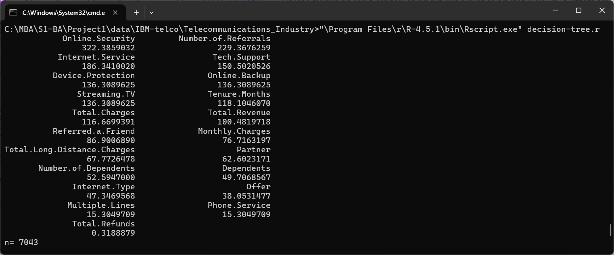
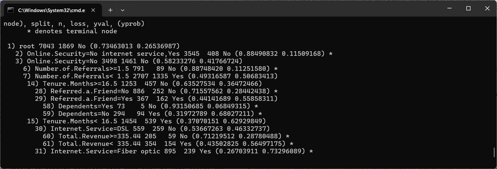
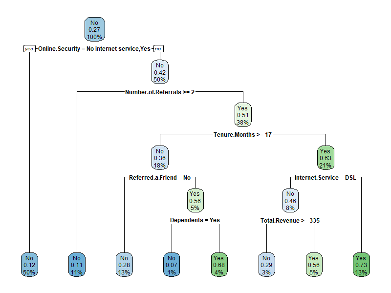

# IBU-MBAC1022025

## IBU MBAC1022025: Business Analytics - Group Case Study

### Group Case Study
Francis (202501????)

Taiwo (202501????)

Giulia (202501????)

Raman (202501????)

Rukmal Mahinda Hettiyakandage Fernando (2025014919)

International Business University

MBAC1022025: Business Analytics

Prof. Foad Aghamiri

August 16, 2025

### About
This repo contains the data preparation scripts and data analysis scripts used in the MBAC1022025 Business Analytics - Group Case Study in the Summer 2025 (Block 2) at International Business University, Toronto, ON., Canada.

### Prerequisites
1. Data: download the IBM Telco Customer Churn dataset. Relevant links:
  - https://accelerator.ca.analytics.ibm.com/bi/?perspective=authoring&pathRef=.public_folders%2FIBM%2BAccelerator%2BCatalog%2FContent%2FDAT00148&id=i9710CF25EF75468D95FFFC7D57D45204&objRef=i9710CF25EF75468D95FFFC7D57D45204&action=run&format=HTML&cmPropStr=%7B%22id%22%3A%22i9710CF25EF75468D95FFFC7D57D45204%22%2C%22type%22%3A%22reportView%22%2C%22defaultName%22%3A%22DAT00148%22%2C%22permissions%22%3A%5B%22execute%22%2C%22read%22%2C%22traverse%22%5D%7D
  - https://www.ibm.com/docs/en/cognos-analytics/12.1.0?topic=samples-telco-customer-churn
2. Data preparation: extract the ZIP file and convert the below files into CSV format, preserving the same file names:
  - Telco_customer_churn.xlsx -> Telco_customer_churn.csv
  - Telco_customer_churn_demographics.xlsx -> Telco_customer_churn_demographics.csv
  - Telco_customer_churn_services.xlsx -> Telco_customer_churn_services.csv
3. Data preparation: install Miller (mlr.exe) from https://miller.readthedocs.io/ or via `winget install Miller.Miller'
4. Data analysis: install the R Project for Statistical Computing from https://www.r-project.org/
5. Run [data-prep.cmd](data-prep.cmd) to generate a single CSV file containing the primary churn data merged with demographic information and information about the services used by the customers

### Data Analysis
1. Run [decision-tree.r](decision-tree.r) to perform Decision Tree analysis. It will output the following:
  - the weight of each independent variable on the outcome variable ("Churn Label")
  - Sample image: 
  - Decision Tree model structure and weights
  - Sample image: 
  - a PNG image (decision-tree-model-1.png) of the resulting Decision Tree model
  - Sample image: 
  
