# IBU-MBAC1022025

## IBU MBAC1022025: Business Analytics - Group Case Study

### Group Case Study

Francis Ogunlaja (2024092880)

Giulia Moliterno Santos (2025015348)

Ramandeep Kaur (2024093666)

Rukmal Mahinda Hettiyakandage Fernando (2025014919)

Taiwo Ernestina Jivoh (2025016367)

International Business University

MBAC1022025: Business Analytics

Prof. Foad Aghamiri

August 16, 2025

### About
This repo contains the data preparation scripts and data analysis scripts used in the MBAC1022025 Business Analytics - Group Case Study in the Summer 2025 (Block 2) at International Business University, Toronto, ON., Canada.
This repo in its entirety is published solely for educational purposes.

### Prerequisites
1. Data: download the IBM Telco Customer Churn dataset. Relevant links:
  - https://accelerator.ca.analytics.ibm.com/bi/?perspective=authoring&pathRef=.public_folders%2FIBM%2BAccelerator%2BCatalog%2FContent%2FDAT00148&id=i9710CF25EF75468D95FFFC7D57D45204&objRef=i9710CF25EF75468D95FFFC7D57D45204&action=run&format=HTML&cmPropStr=%7B%22id%22%3A%22i9710CF25EF75468D95FFFC7D57D45204%22%2C%22type%22%3A%22reportView%22%2C%22defaultName%22%3A%22DAT00148%22%2C%22permissions%22%3A%5B%22execute%22%2C%22read%22%2C%22traverse%22%5D%7D
  - https://www.ibm.com/docs/en/cognos-analytics/12.1.0?topic=samples-telco-customer-churn
2. Data preparation: extract the ZIP file and convert the below files into CSV format, preserving the same file names:
  - `Telco_customer_churn.xlsx` -> `Telco_customer_churn.csv`
  - `Telco_customer_churn_demographics.xlsx` -> `Telco_customer_churn_demographics.csv`
  - `Telco_customer_churn_services.xlsx` -> `Telco_customer_churn_services.csv`
3. Data preparation: install Miller (mlr.exe) from https://miller.readthedocs.io/ or via `winget install Miller.Miller`
4. Data analysis: install the R Project for Statistical Computing from https://www.r-project.org/. The following libraries are needed: `rpart`, `rpart.plot`, `caret`, `ggplot2`, `randomForest`
5. Run [data-prep.cmd](data-prep.cmd) to generate a single CSV file containing the primary churn data merged with demographic information and information about the services used by the customers

### Data Analysis
1. Run [decision-tree.r](decision-tree.r) to build a Decision Tree model using the full dataset. It will output the following:
  - the weight of each independent variable on the outcome variable ("Churn Label")
  - example feature importance output: 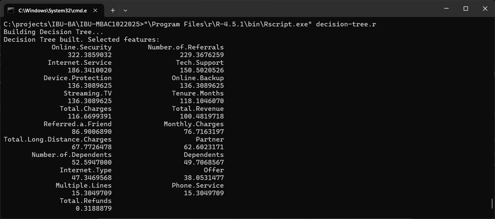
  - Decision Tree model structure and weights
  - example decision tree model output: 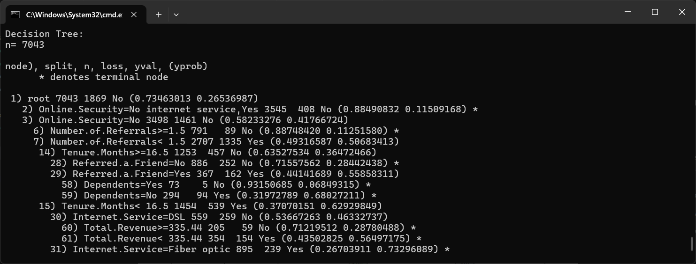
  - a PNG image (decision-tree-model-1.png) of the resulting Decision Tree model
  - example visual representation of decision tree: 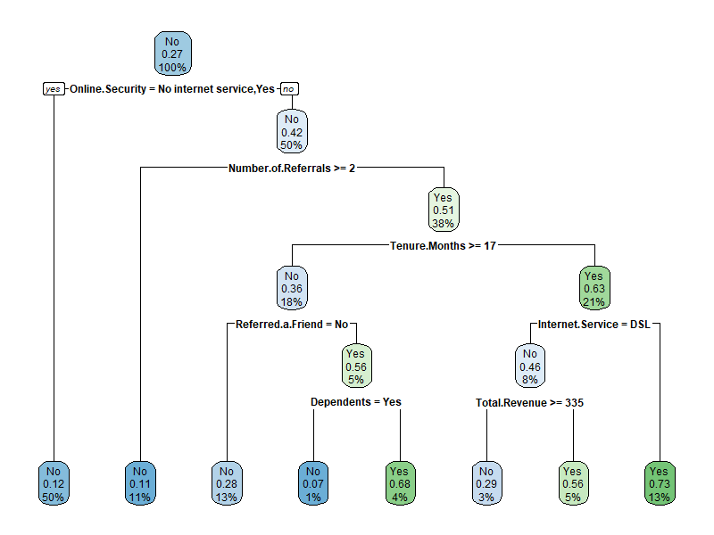
  - use the model for prediction, generate a Confusion Matrix and calculate model accuracy statistics.
  - example confusion matrix and model accuracy output: 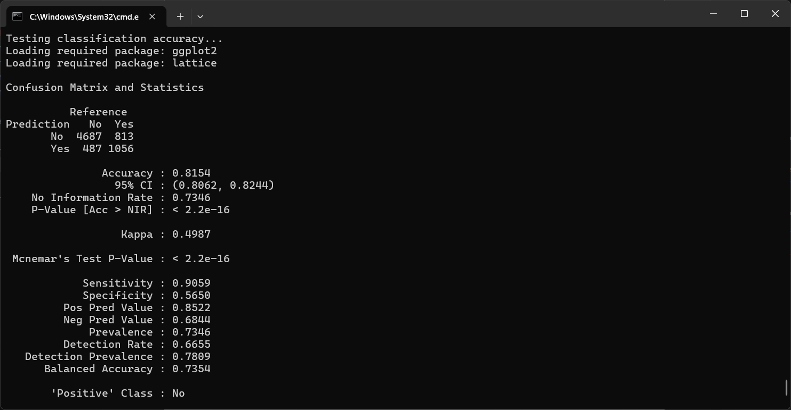
2. Run [decision-tree-classifier.r](decision-tree.r) to train a Decision Tree with 80% of the data, and use the rest for classification. It will output the following:
  - the weight of each independent variable on the outcome variable ("Churn Label")
  - Sample image: 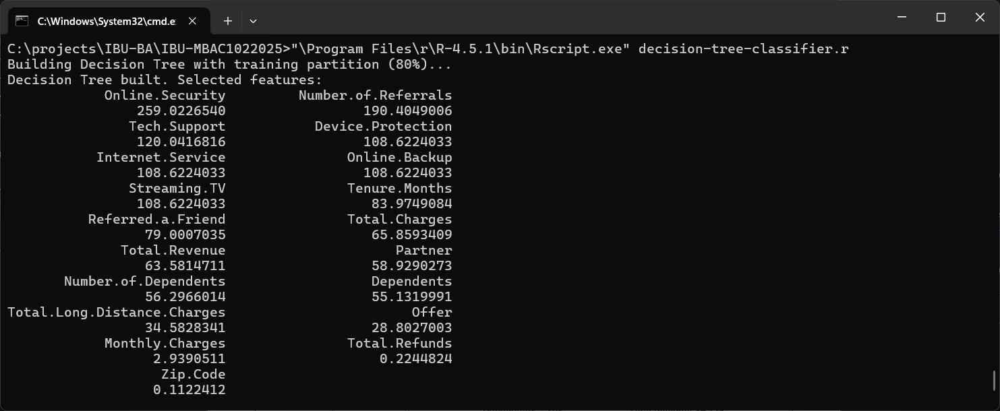
  - Decision Tree model structure and weights
  - Sample image: 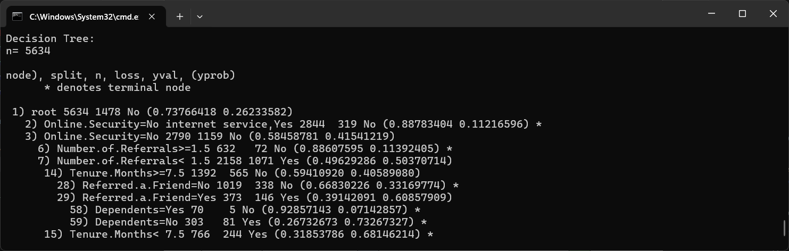
  - a PNG image (decision-tree-model-2.png) of the resulting Decision Tree model
  - Sample image: 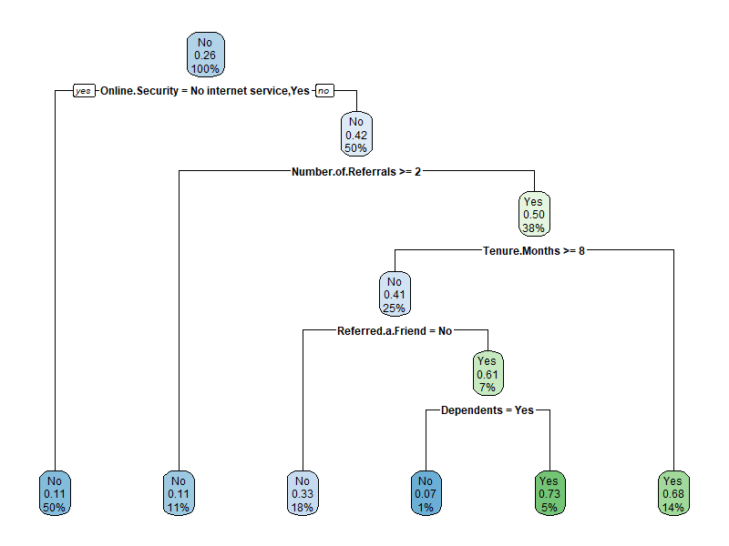
  - use the model for prediction, generate a Confusion Matrix and calculate model accuracy statistics.
  - example confusion matrix and model accuracy output: 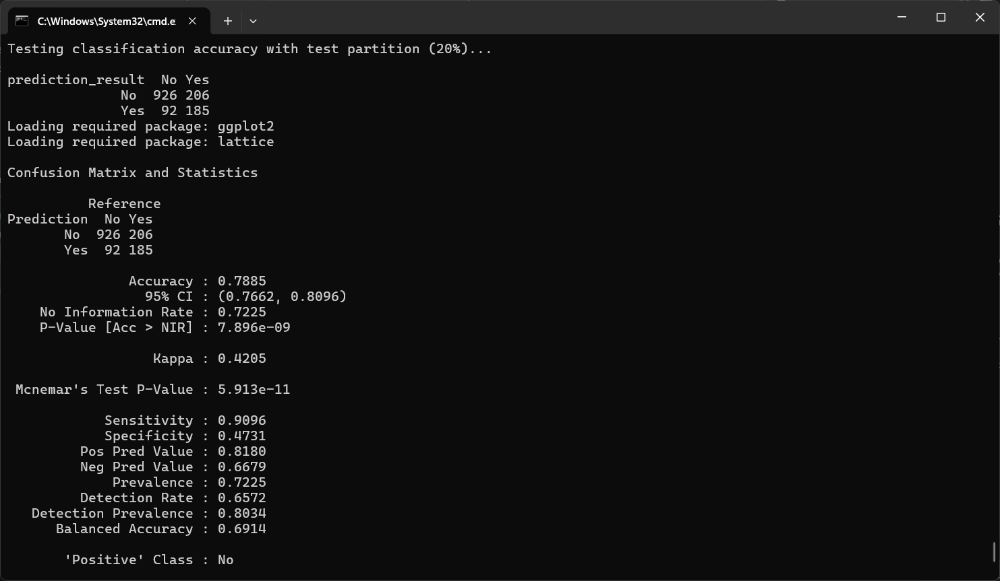
3. Run [random-forest.r](random-forest.r) to build a Random Forest model with the full dataset. It will output the following:
  - Random Forest model structure
  - Sample image: 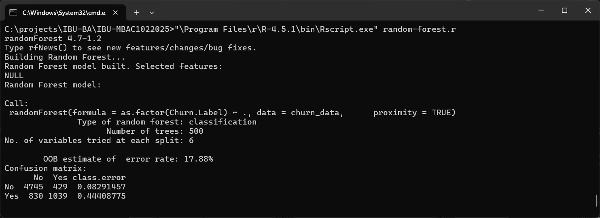
  - a PNG image representing the model accuracy as random trees were added (random-forest-model-accuracy-graph.png)
  - Sample image: 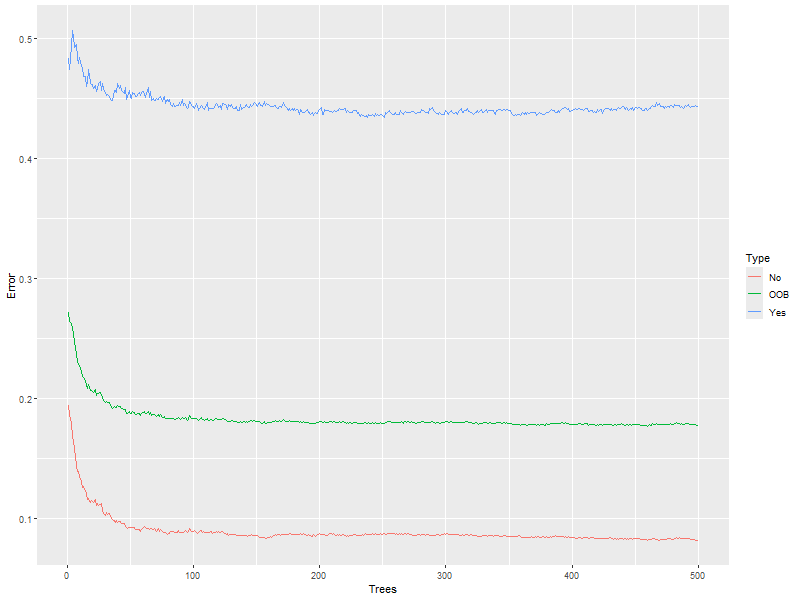
  - use the model for prediction, generate a Confusion Matrix and calculate model accuracy statistics.
  - example confusion matrix and model accuracy output: 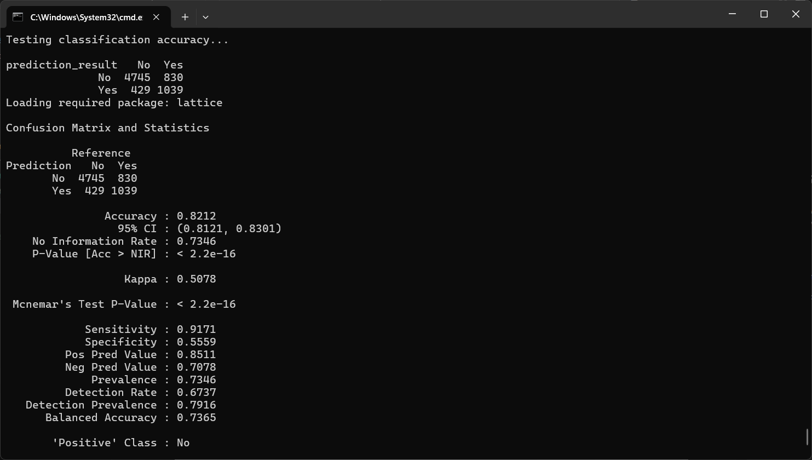
